# Алгоритмы тренировка
## Задача: реализовать очередь и стек на массивах и на списках

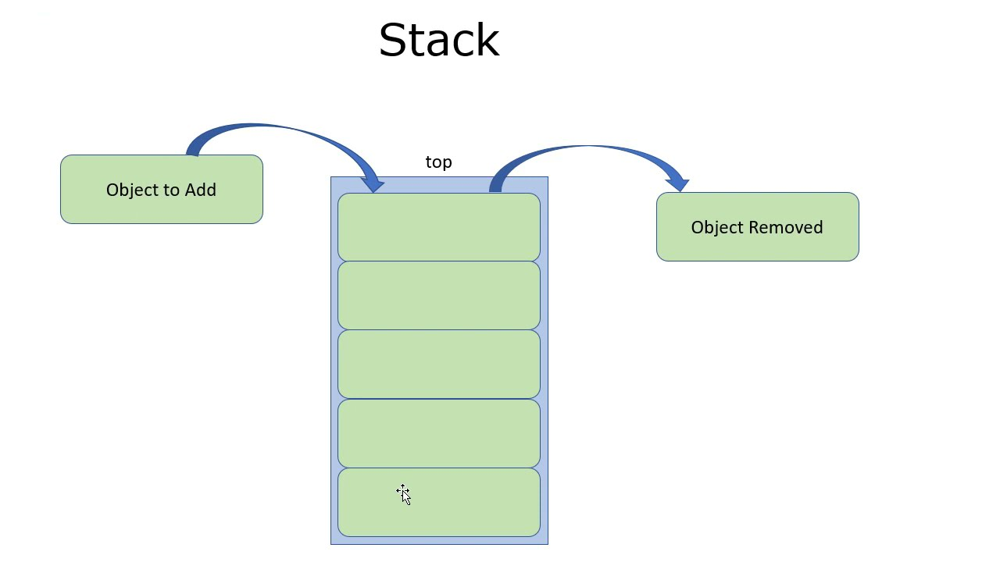
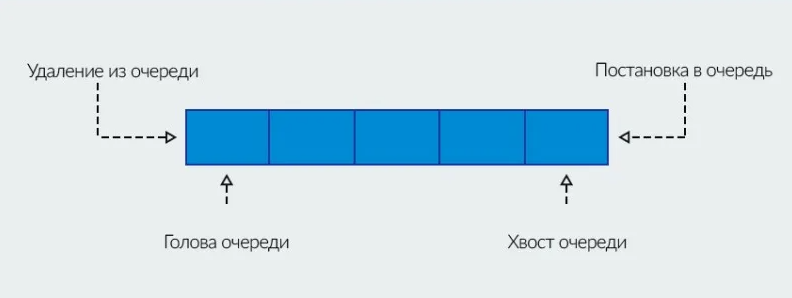

## Графическое представление решения задачи

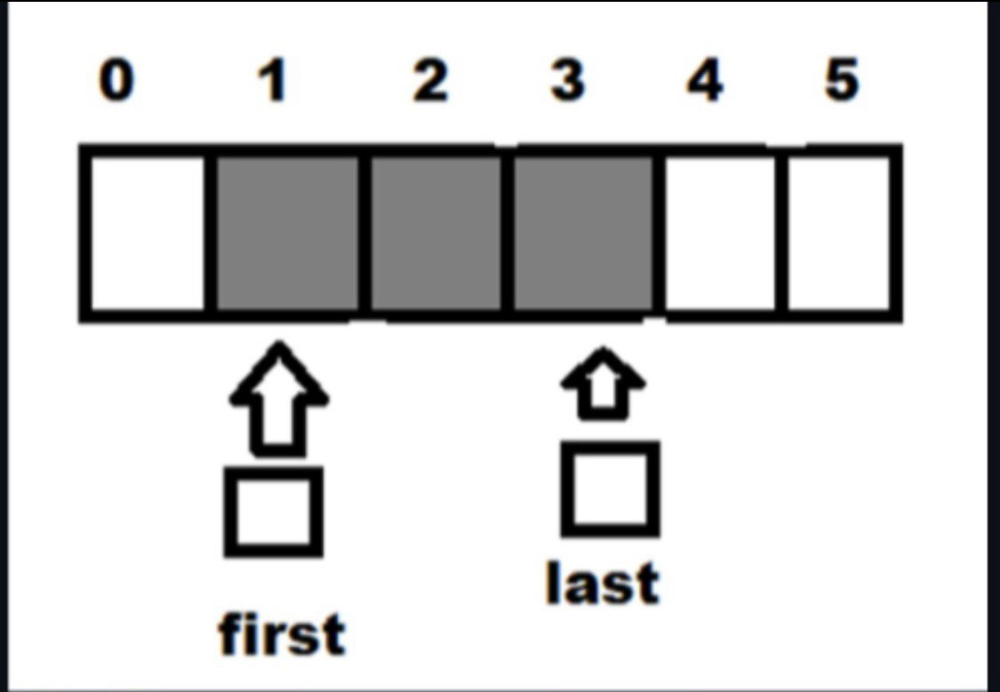

## Пограничные случаи
### Стек на массивах:
#### 1. Стек пуст. Указатель ни на что не указывает.
#### 2. Стек переполнен. Добавлять элементы больше некуда.
### Очередь на массивах
#### 1. Очередь пуста. Указатель на первый элемент никуда не указывает.
#### 2. Очередь переполнена. Добавлять элементы некуда.

## Реализация на языке c++

| Структура Данных  | Функция добавления                 | Функция извлечения                  |
|------------------:|------------------------------------|-------------------------------------|
|стек на списках    |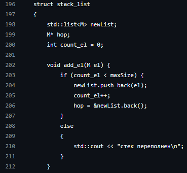  | 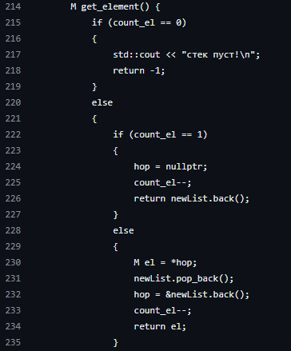|
|стек на массивах   |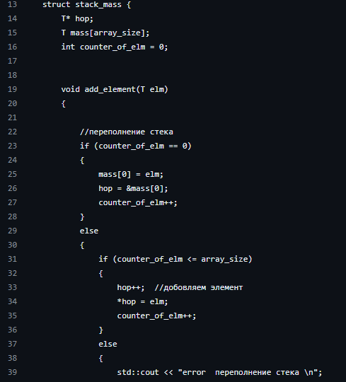  | 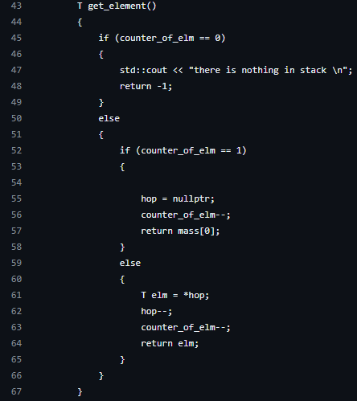 | 
|очередь на списках |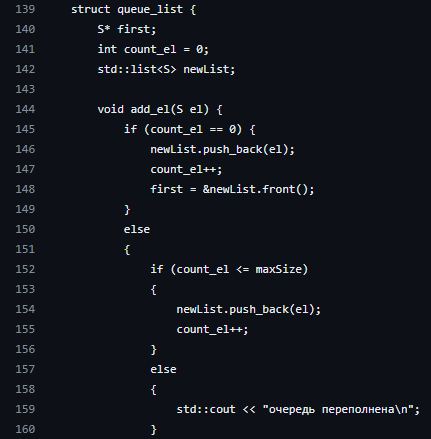  | 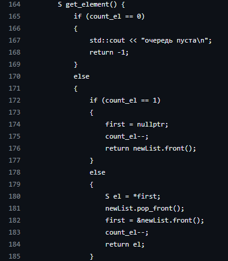|
|очередь на массивах|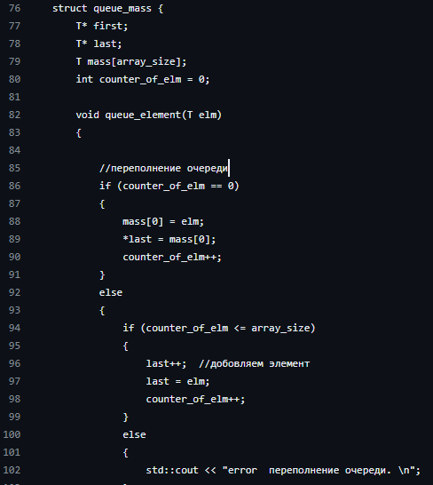  | 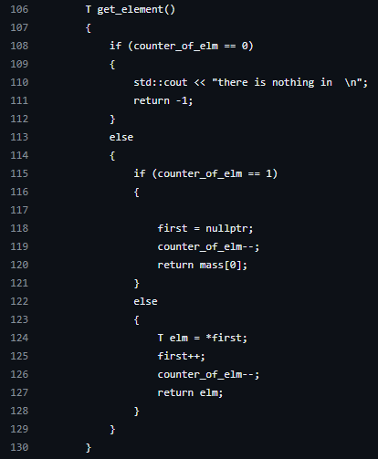|

## Заключение
### Таблица времени

| Количество Элементов | стек на списках                  | стек на массивах                    | очередь на списках              | очередь на массивах             | 
|---------------------:|----------------------------------|-------------------------------------|---------------------------------|---------------------------------|
|1.000                 |                                  |                                     |                                 |                                 | 
|10.000                |                                  |                                     |                                 |                                 |

## Вывод:
#### По сравнению с масивами, списки выполняют свою работу быстрее.
